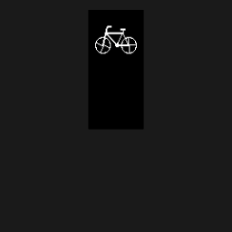

This is a new UI for the SW102 ebike display designed for the open source TSDZ2 ebike motor firmware.

## Demo

Features:

- improved UI with smooth and nice graphics
- more information on the main screen
- graphs :)
- mostly compatible with casainho's version
- more intuitive definition of assist levels

Known issues:

- BT connectivity hasn't been tested
- startup boost menu has been removed (casainho's wiki states that it wasn't working anyway)
- virtual throttle has been removed

## Installation

At the moment you need to build from source, see [here](firmware/SW102/README.md) for instructions. 

If you have already installed casainho's SW102 software & bootloader, you can switch to this version and back via bluetooth. See the [wiki page](https://github.com/OpenSourceEBike/TSDZ2_wiki/wiki/Flash-the-firmware-on-SW102) for flashing instructions.

## Usage

 The main screen is explained in the video below. The following elements are visible:
 
 - left bar: assist level
 - right bar: instanenous motor power
 - top: battery icon & percentage
 - central large display: speed
 - central small display: extra information (odometer, trip distance, trip time, average speed, pedal power, motor power)
 - bottom indicators: WALK (walk assist), BRK (braking), ~~BT (not active at the moment)~~, lights
 
 
 The following key actions are available:
 - **UP/DOWN**: adjust assist level
 - **PWR**: toggle lights
 - hold **PWR**: turn off
 - **M**: cycle extra information display
 - hold **M**: enter configuration menu
 - hold **UP**: toggle Street Mode (if enabled in configuration)
 - hold **DOWN**: Walk Assist (if enabled in configuration)
 
 
 In the configuration screen,  you use UP/DOWN for navigation, M to accept, and PWR to go back.

## Compatibility

This software is based on casainho's [Color_LCD](https://github.com/OpenSourceEBike/Color_LCD) repository. So far, the flash configuration format has not been modified, so you can flash back and forth between the original 1.1.0 firmware and this variant, and the configuration will be kept intact.

### Assist level definition

I've tried to make the definition assist levels more intuitive. In casainho's version, the assist level is a factor relating the instantaneous pedal power (in Watts) to motor current (in abstract ADC units). In this version, the assist level is defined as percentage: 100% means that the motor will give roughly the same power as the rider, 50% means half, and 200% means twice the power. The assist level is recomputed dynamically based on the battery voltage, so as a bonus, it will adapt to keep the same power regardless of the state of charge.

The values stored in flash are still compatible with the original version. This means that if you flash this firmware, you will see percentage values in the assist configuration menu, but the flash contents will not be changed, and the assist level will be *roughly* the same.

### 850/860 displays

Although this repo contains code for the 8xx displays, it's just leftovers from the fork. The code for these displays should compile but there are no functional changes compared to the original repo.
 
 
## Development

### Source changes relative to the Color_LCD repo

I've reused most of the "backend" code related to communications with the motor controller and various internal state. All UI code, including the uGUI library has been removed and replaced with a new implementation. Call it [NIH syndrome](https://en.wikipedia.org/wiki/Not_invented_here) if you like :). The UI blitting code was optimized for the 1-bit monochrome display and allows the display to update at 50 frames per second.

### Emulator build

The firmware supports an "emulator" build, where it's compiled as a regular Linux app. This allows for a much quicker development cycle. Run this command in the firmware/SW102 directory to build the **emu** binary.

    make -f Makefile.emu
